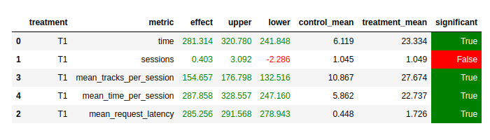

#### Денис Шибитов, MADE, dshibitov@gmail.com

## 1. Отчет размером в одну страничку:

### 1.1. Abstract: основную идею эксперимента (1 параграф)
За основу взят Contextual рекоммендер, показанный на семинаре. Изменено то, что ищутся рекомендации
не для предыдущего трэка, а для первого трэка пользователя (что логично, мы ведь и на семинаре при
подготовке данных для обучения эмбендингов трэков, делали предположение что первый трэк сильно
характеризует вкусы пользователя). Ну и целом это логично. Так же добавлена фильтрация уже прослушенных
пользователем трэков, до тех пор пока это возможно (пока есть ещё не порекомендованные нами).
Из доступных 100 трэков, рекомендуем "расширяющимся окном", т.е. сначала выбираем случайно из первых 10-ти,
потом 20-ти (без первых 10-ти которые уже выбыли) (.., 40, 70, 100) Если закончились все 100 изначально доступных 
трэков - рекомендуем первые 15 (из изначальных 100) случайным образом.

### 1.2. Детали: минимум того, что нужно знать, чтобы разобраться в реализации
Особых деталей нет. Для запоминания первого трэка пользователя и уже прослушенных трэков был добавлен кэш
(в нашем учебном примере использовал просто dict).

### 1.3. Результаты A/B эксперимента - в табличке как на семинарах (1 параграф + табличка)
Из эксперимента (1000 episodes) виден положительный значимый эффект на целевую метрику (mean_time_per_session)

## 2. Ссылка на репозиторий и инструкцию по запуску.
Репозиторий (ветка hw): https://github.com/y-met/recsys-itmo-spring-2023
Запуск контейнера такой же как и на семинаре, никаких новых зависимостей нет.
Запуск симуляции: python sim/run.py --episodes 1000 --config config/env.yml multi --processes 1

PS. На самом деле, задание интересное. Несколько расстроило, что много чего попробовал, но при этом
значимый прирост дали только описанные выше вещи, а что-то что было интересно само по себе не взлетело).
Например пробовал обучать эмбендинги пользователей (как раз пытался извлечь "вкусы" каждого конкретного пользователя),
так же пробовал обучать различные комбинации их эмбендингов и эмбендингов трэков.
Для этих экспериментов собрал б`ольший набор данных (больше в 3.4 раза). Но лучший полученный
эффект был 10-15%, поэтому не стал в итоге включать все эти искания в итоговый отчёт.
Кстати говоря, на этих собранных данных, эффект от реализованных выше идей выглядит ещё сильнее (сравнивал
с переобученным на этих же (новых) данных Contextual).
