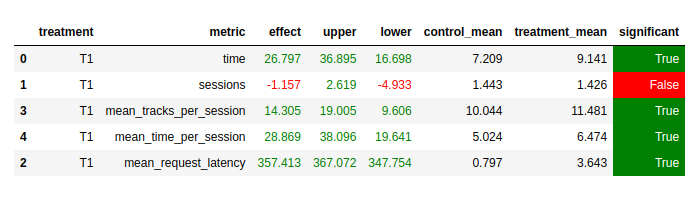
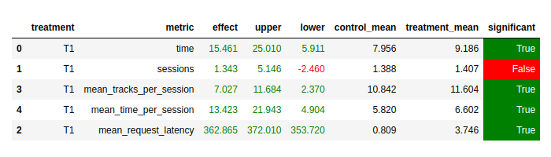
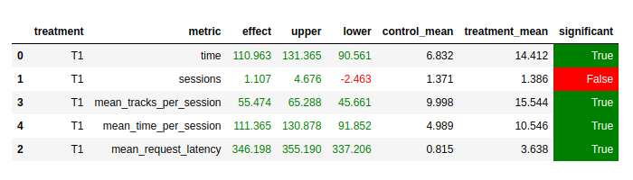
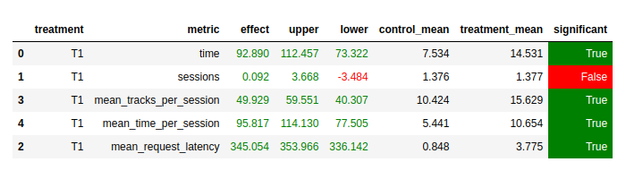

## 1. Описание
Для начала опишу что представляет из себя "ещё одна версия" содержащаяся в этой папке
(все изменения касаются модуля botify - не стал копировать все целиком, просто воспроизвел
структуру и файлы которые были изменены для этой версии). Данная версия можно сказать,
была отправной точкой в серии моих экспериментов и поисков. За основу я взял Contextual,
при этом было желание как то добавить использование эмбедингов пользователей + сохранить
скалярное произведение для оценивание кандидатов (так как не хотел тащить новые библиотеки
и усложнать докер образ botify). Поэтому остановился на конкатенации эмбединга пользователя и
эмбединга предыдущей песни и скалярном произведении с кандидатом для получения предсказания.
Так же, ввиду того что повышается вариативность для первого члена в произведении (возможны все юзеры * 
на все треки), решил собрать больше данных для обучения (собрал в итоге 3.3 раза больше чем набор
с семинара). Все это дело обучил, по аналогии с тем как делали с Contextual на семинаре
(файл Week4Seminar_train_embeddings.ipynb). Полученные эмбединги находятся в botify/data/embeddings.
Использует их новый рекомендер user_track_embd.py. То что получилось выигрывало у Contextual
с семинара (опускаю описание подбора соотношения размеров эмедингов пользователя и предыдущего трека):

Вроде бы успех, можно останавливаться. Но я считаю что не совсем корректно сравнивать модели
которые обучались на разных наборах данных. Я заново обучил Contextual уже на новых собранных мной
данных, и сравнил модели заново:

Качество Contextual повысилось, и теперь на 1000 эпизодов эффект периодически становился не значимым (~1 раз из 5).
При этом при большом количестве эпизодов эффект улучшения всегда был значим. Но я не знаю как будет выполняться
проверка поэтому решил попытаться улучшить свой рекомендер, чтобы он наверняка был лучше даже при 1000 эпизодах.
Дальше, я подумал о том, что стоит попробовать упростить схему - оставить только эмбединг пользователя
и эмбединг кандидата в произведении. - такая комбинация давала не значимый эффект ещё чаще.
Дальше я пробовал много что ещё файл experiments_ab_tests.ipynb содержит много результатов а/б тестов
моих экспериментов. Я все держал в голове, что информация о пользователе должна помогать нам, и не мог
понять почему этого не происходит. Тогда я вспомнил что на семинаре было сказано, что первый трэк - вероятно хорошо "описывает"
вкус пользователя и того что происходит в его сессии. И тут я решил оставить в произведении только
эмбединг первого трэка и эмбединг кандидата (так как первый трэк в предположении = предподчтения пользователя).
И вуаля. Кратный рост эффекта! Я был очень рад, как ребенок. Тут же пришло осознание что уже готовый
Contextual можно немного изменить на использование первого трэка пользователя - и получится ровно тоже самое
что у меня с произведением (ну только ограничение в 100 кандидатов - но я и так эксперементировал примерно с таким
числом обычно). В общем в Contextual добавил self.user_track - для сохранения первого трека пользователя и
внес остальные изменения. Я был рад что все наконецто надежно работает и все ок, и на фоне этого решил попробовать
ещё что нибудь, чтобы ещё улучшить результат. У меня теперь появился в server.py cash - решил почему бы не начать хранить
в нём историю прослушивания пользователя, чтобы фильтровать то что пользователь уже слушал (так как помню ещё с парвого
семинара что повторное прослушивание даже хорошего трэка сильно штрафуется). Сказано сделано - снова сильный рост эффекта.
Потом я ещё поигрался с выбором кандидатов. Это привело к функции _filter_previous. Она не дала прямо большого роста
эффекта, но все же давало ощутимый. Ещё границы подбирал эмперически borders=(10, 25, 40, 70, 100). Никакого объяснения
"на пальцах" им у меня нет, но такая последовательность дала лучший эффект в моих экспериментах.

Готовя эту дополнительную версию, я решил добавить её результаты при использовании в ней "хитрого" рандома для выбора
из кандидатов. Резуьтаты против Contextual с семинара:

Против дообученного Contextual:

## 2. Заключение
Я понимаю, что в задании не предусмотрено механизма "дополнительной" версии. И прошу извинить за простыню
выше. Просто я потратил немало времени на выполнение этого задания и хотел этим показать
что я действительно пробовал разные варианты и тот что я получил в итоге, хоть и является простым
был результатом моих собственных поисков. Так же хотел дополнительно показать что у меня было и другое решение
которое выглядит не таким очевидным и так же удовлетворяет условию задания (выигрывает у Contextual).
Спасибо за ваше терпение (за то что дочитали до конца:) ).
